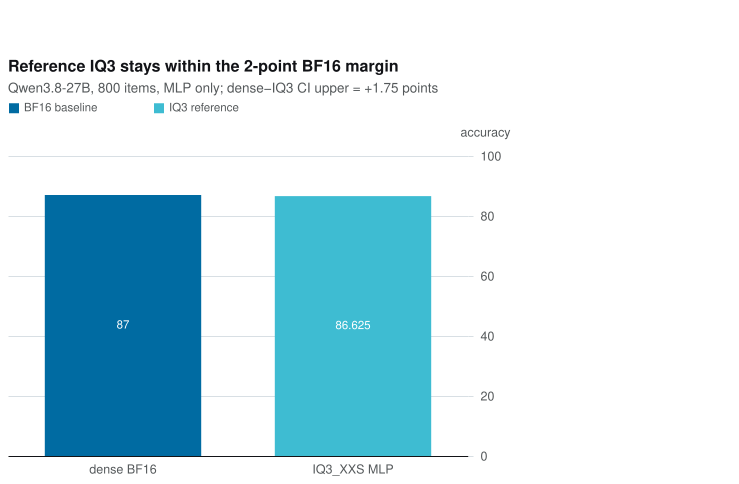

# MIX-STQ — where low-bit quantization stops costing accuracy

A measurement study, not a codec proposal. It started as a learned ternary
codebook (LTC) meant to beat the fixed 3:4 pattern set of `STQ1_0`, and exposed
something more basic: a low-error proxy is not deployment evidence unless its
states can actually be stored by the target format.

Artifacts and importance matrices: [topabaem/mix-stq-artifacts](https://huggingface.co/datasets/topabaem/mix-stq-artifacts)

## Headline result

Qwen3.8-27B, MMLU 140 + ARC-Challenge 60, paired McNemar plus bootstrap CI.
The measured dense baseline is **FP16**, not the BF16 number on the model card.

| arm | encoder | bpw | accuracy | vs dense FP16 | p | verdict |
|---|---|---:|---:|---:|---:|---|
| dense FP16 | dense | 16 | **0.8050** | baseline | — | — |
| IQ2_XXS | approximation, not storable | 2.0625 | 0.7300 | −0.0750 | **0.0007** | search result only |
| IQ3_XXS | approximation, not storable | 3.0625 | 0.7900 | −0.0150 | 0.5078 | optimistic proxy |
| **IQ3_XXS** | **reference-constrained** | **3.0625** | **0.7700** | **−0.0350** | **0.1185** | **unresolved** |
| IQ3_S | approximation, not storable | 3.4375 | 0.7900 | −0.0150 | 0.4531 | search result only |



The reference-constrained IQ3_XXS point estimate loses 3.5 percentage points.
Its paired 95% interval permits a dense advantage from 0.0 to 7.5 points, so
the run proves neither significant damage nor equivalence. The former claim
that 3.0625 bpw preserves full accuracy is withdrawn pending an 800+ item,
dtype-aligned run. See [`mix-stq-v25-reference-iq3.md`](docs/mix-stq-v25-reference-iq3.md).

## What did not survive measurement

Recorded rather than quietly dropped. Each has a dated research note in `docs/`.

| claim | fate |
|---|---|
| LTC beats the fixed pattern set | true on perplexity (−13.9%), **false on task accuracy** (delta 0.0000, p=1.0000) |
| LTC replaces IQ2_XXS | false: IQ2_XXS wins by 2.2% perplexity at equal bits |
| Sensitivity-driven layer allocation helps | false: worst assignment indistinguishable from best |
| Mixing tiers by layer helps | false: what sets accuracy is the *lowest* tier present, not the average bpw |
| 2.06–2.69 bpw is a plateau | artifact of OLMoE's low baseline; on 27B IQ2_XXS loses significantly |
| IQ3_S beats dense FP16 | did not reproduce on 27B |
| IQ3_XXS preserves full accuracy | **unresolved** with the valid encoder: −3.5 points, CI allows up to −7.5 |

The LTC line is closed. A learned 32-entry codebook loses to a fixed 256-entry
grid by 12.5 points at the same 4-value lane structure, and growing the codebook
to 256 entries would cost eight address bits and collapse into IQ3_XXS.

## Why reconstruction error misleads

A caveat first: the error figures below come from an approximate encoder that
does not enforce two IQ-format constraints — the 7-bit even-parity sign packing
and the per-subblock shared scale. It understates real IQ3_XXS error by about
3.5x. Arm-to-arm comparisons hold since every arm went through the same
encoder, but the absolute values are not ggml's. See
`docs/mix-stq-v24-encoder-audit.md` and `src/mixstq/iq3_reference.py`.

Weighted mean error is a poor proxy for task accuracy in two specific ways.

Below a threshold it saturates: from 2.06 to 2.56 bpw error improves 36% while
accuracy drifts *down* a point. Only the 80% drop at 3.06 buys anything.

Under mixed allocation it inverts: an arm with 28% lower error than IQ2_S scored
lower, because averaging hides the bottleneck tensors.

## Encoder

There are three encoder paths. `iq3_reference.py` is a faithful NumPy port of ggml's
`quantize_row_iq3_xxs_impl`, including parity forcing, the 31-point scale
search, and off-grid lane repair. `iq3_vectorized.py` is the GPU implementation
and reconstructs exactly the same values as that oracle in the checked shapes.
`torch_iq2.py` is a fast approximation used for sweeps; it solves the scale in
closed form and does **not** produce storable blocks. For a fixed codebook entry
the per-lane objective is quadratic:

```
objective(step) = quadratic * step^2 - 2 * linear * step
step*           = linear / quadratic
minimum         = -linear^2 / quadratic
```

Taking argmin of the minimum over entries replaces a 144-point grid search and
runs 84–102x faster, which turned a 195-minute sweep into 13 minutes. It also
reports lower error, but that is because it optimizes over states the format
cannot store, not because it found a better encoding.

Supported tiers, all extracted from `ggml-common.h` rather than invented:

| tier | bpw | grid | lane |
|---|---:|---:|---|
| IQ2_XXS | 2.0625 | 256 | 8 values |
| IQ2_XS | 2.3125 | 512 | 8 values |
| IQ2_S | 2.5625 | 1024 | 8 values |
| IQ3_XXS | 3.0625 | 256 | 4 values |
| IQ3_S | 3.4375 | 512 | 4 values |

## Harness

Two scoring protocols, because they answer different questions.

`eval_tasks.py` picks the answer by comparing per-letter log-probabilities.
Cheap and low-variance, but not how published numbers are produced.
It records the selected `float16` or `bfloat16` dtype and embeds the per-item
correctness vectors needed to reproduce every paired comparison.

`eval_generative.py` generates an answer and parses it, matching the protocol
behind the official GPQA Diamond figure. Batched, since 198 items at 2048 new
tokens each is otherwise hours per arm.

Both walk MoE fused expert parameters and dense per-projection weights, and both
raise if a plan quantizes nothing — a guard added after a silent no-op produced
a plausible-looking null result.

## What is not verified

- **No GGUF checkpoint exists.** Accuracy is measured by quantizing weights in
  PyTorch, not by writing a file and running llama.cpp. GGUF round-trip and C
  decoder parity are done for LTC only, not for the IQ tiers.
- **The reference IQ3 run has only 200 items.** It scored 0.7700 against dense
  FP16 at 0.8050, but the interval is too wide to establish a deployment-grade
  non-inferiority margin.
- **IQ2 still has no reference encoder.** IQ2 versus IQ3 is not yet a valid
  format-to-format comparison.
- **The measured baseline is FP16.** The BF16 model-card results are external
  published values and were not reproduced by this harness.
- Attention projections and embeddings are untouched; only MLP tensors are
  quantized, so real deployment size would differ.
- Generation quality remains unmeasured: the 32,768-token GPQA run and
  Terminal Bench 2.1 full evaluation have not completed.

## Planned 4–5 bpw deployment controls

After the reference-encoder, 800+ item, GGUF round-trip, and C-parity gates are
closed, the same Qwen revision will be converted to `IQ4_XS`, `Q4_K_M`, and a
`Q5_K_M` quality control. Reports will separate physical file bits per total
model parameter from quantized-payload bits per covered parameter instead of
inferring either value from the preset name.

Every surviving file will run the same paired accuracy set, perplexity,
`llama-bench` throughput and memory measurements, 32,768-token GPQA, and full
Terminal Bench 2.1. Partial and full runs will remain separate results.

## Repository layout

```
src/mixstq/   codecs, codebook fitting, GGUF container, allocator, harnesses
csrc/         reference C decoder and fused vec_dot
tests/        invariants, container round trip, C parity, encoder equivalence
docs/         dated research records, each with a verification log
artifacts/    importance matrices and evaluation outputs
```

## Verification

```bash
python3 scripts/run_tests.py --offline   # tests are standalone scripts, not pytest
python3 -m ruff check .
clang -O2 -Wall -Wextra -o ltc_dequant csrc/ltc_dequant.c
clang -O2 -Wall -Wextra -o ltc_vecdot csrc/ltc_vecdot.c
```

GPU stages use `src/mixstq/vast_control.py`, which defaults to a dry run and
refuses to spend without `--confirm`.
